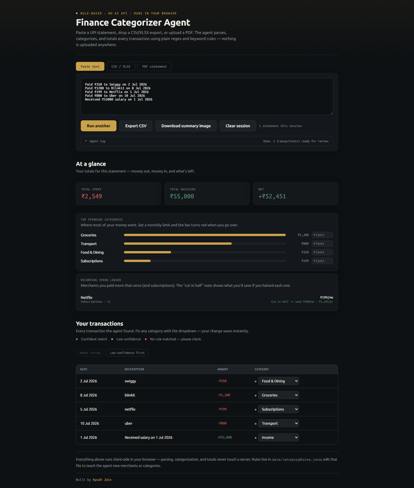
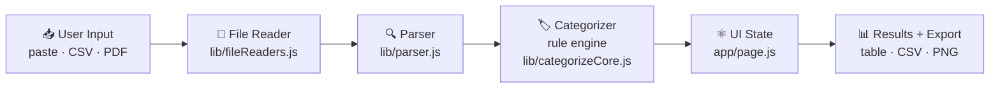
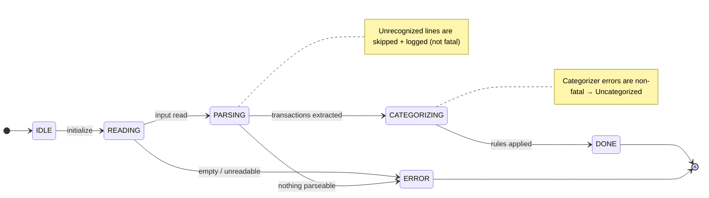
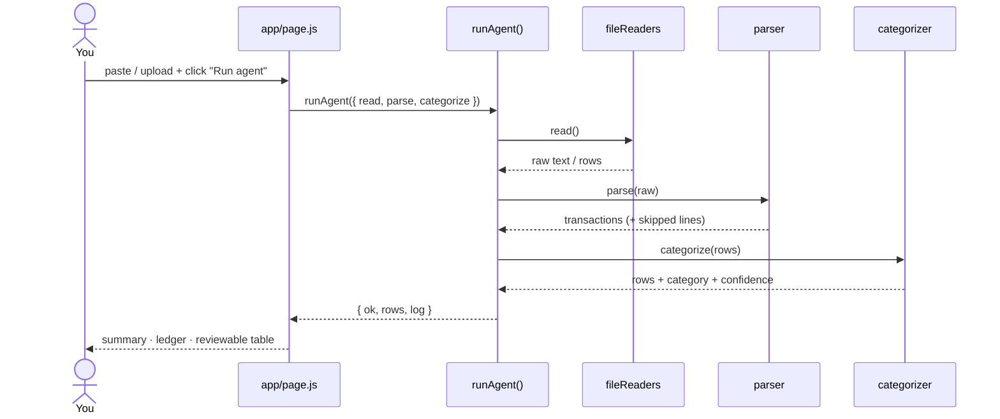

<div align="center">

# 💰 Finance Categorizer Agent

**Drop in your UPI / bank statement and get every transaction sorted into spending
categories — instantly, privately, without a single byte leaving your browser.**

[](https://nextjs.org/)
[](https://react.dev/)
[](#-privacy)
[](#-testing--accuracy)
[](#-testing--accuracy)
[](#-quality-bar)
[](LICENSE)

No AI API. No backend. No sign-up. Just open the page, paste your transactions
(or upload a CSV / XLSX / PDF), and the agent parses, categorizes, and totals
everything using plain JavaScript rules that run entirely on your device.



</div>

---

## 📑 Table of Contents

- [Quick Start](#-quick-start)
- [The Problem → The Solution](#-the-problem)
- [Features](#-features)
- [Privacy](#-privacy)
- [How It Works (High-Level Design)](#-how-it-works-high-level-design)
- [Under the Hood (Low-Level Design)](#-under-the-hood-low-level-design)
  - [1. The Agent State Machine](#1-the-agent-state-machine-libfsmjs)
  - [2. What Happens on a Run](#2-what-happens-on-a-run)
  - [3. The Parser's Strategy](#3-the-parsers-strategy-libparserjs)
  - [4. Categorization & Confidence](#4-categorization--confidence)
  - [5. File-by-File Breakdown](#5-file-by-file-breakdown)
- [Testing & Accuracy](#-testing--accuracy)
- [Quality Bar](#-quality-bar)
- [Local Development](#-local-development)
- [Deploy to Vercel](#-deploy-to-vercel)
- [Teaching It New Merchants](#-teaching-it-new-merchants--categories)
- [Supported Inputs](#-supported-inputs)
- [Author & License](#-author--license)

---

## 🚀 Quick Start

New here? You'll have it running in three commands:

```bash
git clone https://github.com/URAYUSHJAIN/finance-agent.git
cd finance-agent
npm install && npm run dev     # → open http://localhost:3000
```

Then paste a few lines like these and hit **Run agent**:

```text
Paid ₹350 to Swiggy on 2 Jul 2026
Paid ₹1200 to Blinkit on 8 Jul 2026
Received ₹55000 salary on 1 Jul 2026
```

That's it — no API keys, no `.env`, no database. Want to verify the brain works?
Run `npm test` (parser regression tests + a categorization accuracy eval).

---

## 🎯 The Problem

- Manually tagging hundreds of UPI payments as "food", "rent", "shopping" is **tedious and error-prone**.
- Most finance / expense apps make you **upload your bank statement to their servers** — handing over some of the most sensitive data you own.
- "Smart" AI categorizers are a **black box**: you can't see *why* a transaction was labelled the way it was, and you often can't fix it in bulk.

## ✅ The Solution

A browser-based agent that does the boring part for you:

- **Reads** pasted text, CSV / XLSX exports, or text-based PDF statements.
- **Sorts** each transaction into a category using a transparent keyword rule engine.
- **Totals** your spend by category and month, flags recurring costs, and lets you export a clean CSV or a shareable summary image.

### 💡 Why It's Different

| Most finance apps | Finance Categorizer Agent |
|---|---|
| Upload data to a server | **Zero data leaves your browser** |
| Need an account / API keys | **No keys, no login, no config** |
| AI black-box labels | **Rule-based & transparent** — every label is a keyword match you can read and edit |
| Unmeasured "smart" claims | **~98% accuracy** on a 41-transaction labeled set (`npm run test:eval`) |
| You trust it blindly | **Confidence shown per row** — low-confidence guesses are flagged for review |

---

## ✨ Features

| | Feature | What it does |
|---|---|---|
| 📥 | **3 input modes** | Paste text, drop a CSV / XLSX, or upload a text-based PDF statement |
| 🏷️ | **Transparent categorization** | 14 categories via an editable keyword rule engine — no ML, no API |
| 🎯 | **Per-row confidence** | Low-confidence guesses are dot-flagged and filterable under *Needs review* |
| 📊 | **At-a-glance totals** | Money out, money in, and net — plus your top spending categories |
| 💸 | **Budget alerts** | Set a monthly limit per category; the bar turns red when you go over |
| 🔁 | **Recurring-spend ledger** | Spots merchants you paid more than once, with a "cut this in half → save ₹X/yr" projection |
| 📈 | **Month-over-month & vs-last-upload** | Upload several statements in one session and see the deltas |
| 🖼️ | **Export** | Download a clean CSV, or a themed PNG summary card (rendered on a canvas, no server) |
| ⚡ | **Fast on big statements** | 300+ transactions parse, categorize, and render in ~140 ms; the table paginates |
| ♿ | **Keyboard accessible** | Every control is reachable with a visible focus ring (Lighthouse a11y 100) |
| 🔒 | **Private by design** | Nothing — not even the fonts — is fetched from a third party at runtime |

---

## 🔒 Privacy

Everything is client-side. Parsing, categorization, and totals **never touch a
server** — you can literally turn off your network after the page loads and it
still works. Files are read in-browser via the `FileReader` API; the PDF worker
and the web fonts are **self-hosted**, so the page makes **no third-party
requests** at all.

---

## 🧭 How It Works (High-Level Design)

The app is a pipeline. Your input flows left-to-right through five layers, and the
agent's state machine drives the whole trip.



| Layer | What it's responsible for (in plain English) |
|---|---|
| **User Input** | You choose one of three tabs — paste transaction lines, drop a CSV / XLSX, or upload a PDF. |
| **File Reader** | Turns whatever you gave it into something the parser understands: raw text for paste / PDF, or a list of rows for spreadsheets. It never sends the file anywhere — it reads it in the browser. |
| **Parser** | Looks at each line / row and pulls out the four things that matter: the **date**, the **amount**, whether money went **out or in**, and **who** it was paid to. |
| **Categorizer** | Compares each transaction's text against a keyword list and picks the best-fitting category (Food, Transport, Rent…). It also reports how confident it is. |
| **UI State** | Holds the results in memory (React state), including every statement you've run this session so months can be compared. |
| **Results / Export** | Shows the sorted transactions, lets you fix any label, and exports a tidy CSV or PNG. |

---

## 🔩 Under the Hood (Low-Level Design)

### 1. The Agent State Machine (`lib/fsm.js`)

The agent is a small finite state machine. It **never throws out of `runAgent()`** —
every step is wrapped so the caller always gets a result plus a full transition log
(which is exactly what you see in the live log panel).



| State | Trigger (what moves it here) | Next State | Failure handling |
|---|---|---|---|
| **IDLE** | Agent initialized | READING | — |
| **READING** | Read the input source | PARSING | Empty / unreadable input → **ERROR** (fatal, stops the run) |
| **PARSING** | Extract transactions from raw input | CATEGORIZING | Unrecognized lines are **skipped and logged** (not fatal). If *zero* rows are recognized → **ERROR** |
| **CATEGORIZING** | Apply category rules | DONE | If the categorizer throws, it's **non-fatal**: rows fall back to "Uncategorized" and the run still finishes |
| **DONE** | All rows categorized | *(terminal)* | — |
| **ERROR** | Any fatal problem above | *(terminal)* | Returns `{ ok: false }` with the log so the UI can show a friendly message |

> **Key idea:** per-row problems never kill the batch — only truly fatal issues
> (empty input, unreadable file, nothing parseable at all) reach `ERROR`.

### 2. What Happens on a Run

From clicking **Run agent** to seeing your sorted table:



### 3. The Parser's Strategy (`lib/parser.js`)

The parser is pure regex + heuristics, kept generic so it works reasonably across
GPay, PhonePe, Paytm, and plain bank exports rather than being tuned to one format.

- **Date patterns** — tries several shapes in order: `2 Jul 2026`, `2026-07-01` (ISO), `05/07/2026`, `Jul 2, 2026`.
- **Amount patterns** — two tiers:
  1. **Tagged amount** (preferred): a number attached to `₹`, `Rs`, or `INR` — unambiguous.
  2. **Fallback** (no symbol, e.g. PDF / bank rows): scans bare numbers *after stripping out dates*, then **rejects** phone numbers, account tails, reference IDs, OTPs, and years, and prefers a value with paise (`.00`) or a thousands separator. This stops the day-of-month or a reference number from being mistaken for the amount.
- **Direction detection** — keyword hints decide debit vs credit: `paid, sent, debited, withdrew, spent, p2m` → **debit**; `received, credited, refund, salary, cashback` → **credit**; otherwise `unknown`.

**Real examples (input → output):**

| Input line | date | amount | direction | party |
|---|---|---|---|---|
| `You paid ₹1,200 to Blinkit using HDFC Bank` | — | `1200` | debit | `blinkit` |
| `Rs.2,499.00 debited from a/c XXXX1234 on 05-07-2026 to VPA zomato@ybl Ref 512` | `05-07-2026` | `2499` | debit | `zomato@ybl` |
| `02 Jul 2026 UPI-SWIGGY-402312 350.00 12000.00` | `02 Jul 2026` | `350` | unknown | (description) |

*(That last row is the tricky one: `02` is a date, `402312` a reference, `12000.00`
the balance — the parser correctly picks `350.00`.)*

### 4. Categorization & Confidence

Rules live in `data/categoryRules.json` (category → list of lowercase keywords) and
the scoring is deliberately simple — see `lib/categorizeCore.js`:

1. Build a haystack from the transaction's `description + raw` text.
2. For each category, **count how many of its keywords appear** in the haystack.
3. The category with the **highest count wins**.
4. **Confidence** = `score === 0 ? 0 : min(1, score / 2)` — so 1 keyword hit = 0.5, 2+ hits = 1.0, no hit = 0.
5. **Income override**: a credit with no keyword match is still labelled `Income` (but at confidence 0, so it's flagged for review).

A confidence of **0** means "no rule matched" — those rows are surfaced in the UI's
*Needs review* filter so you can fix them in bulk.

<details>
<summary><strong>📋 All 14 categories (click to expand)</strong></summary>

<br/>

`Food & Dining` · `Groceries` · `Transport` · `Shopping` · `Bills & Utilities` ·
`Rent & Housing` · `Subscriptions` · `Entertainment` · `Health & Medical` ·
`Education` · `Investments` · `Transfers & Family` · `ATM & Cash` · `Income`

Each maps to a keyword list you can freely edit — see
[Teaching It New Merchants](#-teaching-it-new-merchants--categories).

</details>

### 5. File-by-File Breakdown

| File | Responsibility | Key exports |
|---|---|---|
| `lib/fsm.js` | The agent state machine; orchestrates read → parse → categorize with full logging | `runAgent()`, `STATES` |
| `lib/parser.js` | Regex / heuristic parsing of text & tabular rows; month bucketing | `parseGenericText()`, `parseTabularRows()`, `toMonthKey()` |
| `lib/categorizeCore.js` | Pure keyword-scoring logic; rule table is passed in (import-free so it runs in the app, the eval, and tests) | `categorizeTransactions(rows, rules)`, `categoryList()` |
| `lib/categorizer.js` | Thin wrapper that binds the bundled `categoryRules.json` to the core | `categorizeTransactions()`, `CATEGORY_LIST` |
| `lib/fileReaders.js` | Browser-only readers for text, CSV / XLSX (via `xlsx`), and PDF (via `pdfjs-dist`); `xlsx` / `pdfjs` are dynamically imported so they stay out of the initial bundle | `readFileAsText()`, `readSheetRows()`, `readPdfText()` |
| `data/categoryRules.json` | The editable rule table (category → keywords) | *(JSON data)* |
| `app/page.js` | The whole UI: tabs, upload, live log, summary, per-category budgets, recurring-spend ledger + what-if, vs-last-upload diff, month-over-month, paginated results table, CSV + PNG export | `Home` (default) |
| `app/layout.js` | Root HTML shell, self-hosted fonts (`next/font`), metadata + JSON-LD | `RootLayout`, `metadata` |
| `app/globals.css` | Dark "ledger" theme, glassmorphism, responsive / mobile layout | *(styles)* |
| `lib/parser.test.js` | Zero-dependency parser regression tests | *(run with `npm run test:parser`)* |
| `lib/eval.js` | Categorization accuracy eval on a labeled test set | *(run with `npm run test:eval`)* |

---

## 🧪 Testing & Accuracy

Two zero-dependency Node scripts (no test framework) keep the "brain" honest:

```bash
npm run test:parser   # 32 assertions on amount / date / direction / party extraction
npm run test:eval     # categorization accuracy on a labeled test set
npm test              # both, back to back
```

**Measured accuracy: ~98% (40/41) categorization accuracy on a 41-transaction
labeled test set** spanning every category. The harness ([`lib/eval.js`](lib/eval.js))
prints per-category accuracy and lists every miss. The single current miss
(`₹500 refund from Amazon` → *Shopping* instead of *Income*) is a genuine keyword
tie between `refund` and `amazon` — exactly the kind of ambiguity the per-row
confidence flag exists to catch.

Because `categorizeCore.js` takes its rule table as a parameter, the eval runs the
**same scoring code** the app ships — not a reimplementation.

---

## 📏 Quality Bar

Production build, audited with Lighthouse (mobile):

| Performance | Accessibility | Best Practices | SEO |
|:---:|:---:|:---:|:---:|
| **98** | **100** | **100** | **100** |

- **First Load JS: ~98 kB** — `pdfjs-dist` (~1 MB) and `xlsx` (~400 kB) are dynamically
  imported, so they load only when you open their tab, never on first paint.
- **Fonts self-hosted** via `next/font` → no render-blocking third-party request.
- **CLS ~0**, **TBT ~20 ms**, **LCP ~2.2 s** under throttled mobile emulation.

---

## 🛠️ Local Development

```bash
npm install
npm run dev          # http://localhost:3000
npm run build        # production build
npm start            # serve the production build
npm test             # parser regression tests + categorization eval
npm run test:parser  # just the parser regression tests
npm run test:eval    # just the categorization accuracy eval
npm run clean        # remove .next and node_modules/.cache
```

<details>
<summary><strong>🩹 If hot-reload breaks (chunk / 404 / <code>ERR_CONNECTION_REFUSED</code>)</strong></summary>

<br/>

Next's dev server keeps its build in `.next`. If that cache goes stale — or, on
Windows, if the project lives inside a **OneDrive / Dropbox-synced folder** that
locks or re-syncs `.next` files while webpack is rewriting them — you can get
`Loading chunk … failed`, 404s on `/_next/static/...`, or `ERR_CONNECTION_REFUSED`
after a recompile. Recover with:

```bash
npm run clean        # wipe the stale build cache
npm run dev          # start fresh
```

If it keeps recurring, move the project outside the synced folder (e.g.
`C:\dev\finance-agent`) or pause OneDrive while developing. Production
(`npm run build` + `npm start`, or Vercel) is unaffected — it serves fixed static
files that are never rewritten on the fly.

</details>

---

## ▲ Deploy to Vercel

**From your machine (no GitHub needed):**

```bash
npm install -g vercel
cd finance-agent
vercel           # follow prompts → live URL in ~30s
vercel --prod    # push to production
```

**Or GitHub import:** push to a repo → [vercel.com](https://vercel.com) → New Project
→ Import → Deploy. No environment variables, no server config — it's a static
Next.js app.

---

## 🧩 Teaching It New Merchants / Categories

Edit `data/categoryRules.json`. Each key is a category; each value is a list of
lowercase keywords matched against the transaction description. Add `"blinkit"`
under `"Groceries"` and it takes effect immediately in `npm run dev` (or on your
next deploy) — then re-run `npm run test:eval` to confirm you didn't regress
anything.

---

## 📄 Supported Inputs

- **Paste text** — copy transaction lines from any UPI app's history screen.
- **CSV / XLSX** — bank / app statement exports; auto-detects common headers (Date, Narration / Description, Amount, Debit / Credit).
- **PDF** — text-based PDF statements only (no OCR, so scanned / image PDFs aren't supported — that would need an API).

> Parsing is intentionally best-effort and generic, so double-check a few rows after
> each run — especially on a new statement format you haven't tried before. The
> per-row confidence dots tell you where to look first.

---

## 👤 Author & License

**Ayush Jain** — Final-year B.Tech CSE, ABES Engineering College, Ghaziabad (AKTU, 2023–2027).
Currently **SDE Intern at notwant to reviel bro**.
Portfolio: [urayushjain.tech](https://urayushjain.tech) · LinkedIn: [@URAYUSHJAIN](https://www.linkedin.com/in/URAYUSHJAIN)

*Built as part of my off-campus project portfolio.*

Released under the [MIT License](LICENSE).
