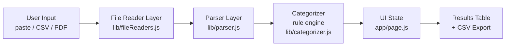

# Finance Categorizer Agent

**Drop in your UPI/bank statement and get every transaction sorted into spending categories — instantly, privately, without a single byte leaving your browser.**

No AI API. No backend. No sign-up. Just open the page, paste your transactions (or upload a CSV/XLSX/PDF), and the agent parses, categorizes, and totals everything using plain JavaScript rules that run entirely on your device.

---

## 🎯 The Problem

- Manually tagging hundreds of UPI payments as "food", "rent", "shopping" is **tedious and error-prone**.
- Most finance/expense apps make you **upload your bank statement to their servers** — handing over some of the most sensitive data you own.
- "Smart" AI categorizers are a **black box**: you can't see *why* a transaction was labelled the way it was, and you often can't fix it in bulk.

## ✅ The Solution

A browser-based agent that does the boring part for you:

- **Reads** pasted text, CSV/XLSX exports, or text-based PDF statements.
- **Sorts** each transaction into a category using a transparent keyword rule engine.
- **Totals** your spend by category and month, and lets you export a clean CSV.

## 💡 Why It's Different

| Most finance apps | Finance Categorizer Agent |
|---|---|
| Upload data to a server | **Zero data leaves your browser** |
| Need an account / API keys | **No keys, no login, no config** |
| AI black-box labels | **Rule-based & transparent** — every label is a keyword match you can read and edit |
| You trust it blindly | **Confidence shown per row** — low-confidence guesses are flagged for review |

Everything is client-side. You can literally turn off your network after the page loads and it still works.

## 👤 Author

**Ayush Jain** — Final-year B.Tech CSE, ABES Engineering College, Ghaziabad (AKTU, 2023–2027).
Currently **SDE Intern at notwant to reviel bro**.
Portfolio: [urayushjain.tech](https://urayushjain.tech)

*Built as part of my off-campus project portfolio.*

---

# High-Level Design (HLD)

The app is a pipeline. Your input flows left-to-right through five layers, and the agent's state machine drives the whole trip.



Plain-text version of the same flow:

```
User Input  ->  File Reader  ->  Parser  ->  Categorizer  ->  UI State  ->  Results Table / Export
(paste/CSV/PDF)  (to raw text/rows)  (to transactions)  (rule engine)  (React state)  (review + download)
```

| Layer | What it's responsible for (in plain English) |
|---|---|
| **User Input** | You choose one of three tabs — paste transaction lines, drop a CSV/XLSX, or upload a PDF. |
| **File Reader Layer** | Turns whatever you gave it into something the parser understands: raw text for paste/PDF, or a list of rows for spreadsheets. It never sends the file anywhere — it reads it in the browser. |
| **Parser Layer** | Looks at each line/row and pulls out the four things that matter: the **date**, the **amount**, whether money went **out or in**, and **who** it was paid to. |
| **Categorizer** | Compares each transaction's text against a keyword list and picks the best-fitting category (Food, Transport, Rent…). It also reports how confident it is. |
| **UI State** | Holds the results in memory (React state), including every statement you've run this session so months can be compared. |
| **Results Table / Export** | Shows the sorted transactions, lets you fix any label, and exports a tidy CSV. |

---

# Low-Level Design (LLD)

## 1. The Agent State Machine (`lib/fsm.js`)

The agent is a small finite state machine. It **never throws out of `runAgent()`** — every step is wrapped so the caller always gets a result plus a full transition log (which is exactly what you see in the live log panel).

States: `IDLE → READING → PARSING → CATEGORIZING → DONE`, with `ERROR` as a bail-out.

| State | Trigger (what moves it here) | Next State | Failure handling |
|---|---|---|---|
| **IDLE** | Agent initialized | READING | — |
| **READING** | Read the input source | PARSING | Empty/unreadable input → **ERROR** (fatal, stops the run) |
| **PARSING** | Extract transactions from raw input | CATEGORIZING | Unrecognized lines are **skipped and logged** (not fatal). If *zero* rows are recognized → **ERROR** |
| **CATEGORIZING** | Apply category rules | DONE | If the categorizer throws, it's **non-fatal**: rows fall back to "Uncategorized" and the run still finishes |
| **DONE** | All rows categorized | *(terminal)* | — |
| **ERROR** | Any fatal problem above | *(terminal)* | Returns `{ ok: false }` with the log so the UI can show a friendly message |

Key idea: **per-row problems never kill the batch** — only truly fatal issues (empty input, unreadable file, nothing parseable at all) reach `ERROR`.

## 2. The Parser's Strategy (`lib/parser.js`)

The parser is pure regex + heuristics, kept generic so it works reasonably across GPay, PhonePe, Paytm, and plain bank exports rather than being tuned to one format.

**Date patterns** — tries several shapes in order: `2 Jul 2026`, `2026-07-01` (ISO), `05/07/2026`, `Jul 2, 2026`.

**Amount patterns** — two tiers:
1. **Tagged amount** (preferred): a number attached to `₹`, `Rs`, or `INR` — unambiguous.
2. **Fallback** (no symbol, e.g. PDF/bank rows): scans bare numbers *after stripping out dates*, then **rejects** phone numbers, account tails, reference IDs, OTPs, and years, and prefers a value with paise (`.00`) or a thousands separator. This stops the day-of-month or a reference number from being mistaken for the amount.

**Direction detection** — keyword hints decide debit vs credit: words like `paid, sent, debited, withdrew, spent, p2m` → **debit**; `received, credited, refund, salary, cashback` → **credit**; otherwise `unknown`.

**Real examples (input → output):**

| Input line | date | amount | direction | party |
|---|---|---|---|---|
| `You paid ₹1,200 to Blinkit using HDFC Bank` | — | `1200` | debit | `blinkit` |
| `Rs.2,499.00 debited from a/c XXXX1234 on 05-07-2026 to VPA zomato@ybl Ref 512` | `05-07-2026` | `2499` | debit | `zomato@ybl` |
| `02 Jul 2026 UPI-SWIGGY-402312 350.00 12000.00` | `02 Jul 2026` | `350` | unknown | (description) |

*(That last row is the tricky one: `02` is a date, `402312` a reference, `12000.00` the balance — the parser correctly picks `350.00`.)*

## 3. Categorization & Confidence (`data/categoryRules.json` + `lib/categorizer.js`)

`categoryRules.json` maps a **category → list of lowercase keywords**. Scoring is deliberately simple:

1. Build a haystack from the transaction's `description + raw` text.
2. For each category, **count how many of its keywords appear** in the haystack.
3. The category with the **highest count wins**.
4. **Confidence** = `score === 0 ? 0 : min(1, score / 2)` — so 1 keyword hit = 0.5, 2+ hits = 1.0, no hit = 0.
5. **Income override**: a credit with no keyword match is still labelled `Income` (but at confidence 0, so it's flagged for review).

A confidence of **0** means "no rule matched" — those rows are surfaced in the UI's *Needs review* filter so you can fix them in bulk.

## 4. File-by-File Breakdown

| File | Responsibility | Key exports |
|---|---|---|
| `lib/fsm.js` | The agent state machine; orchestrates read → parse → categorize with full logging | `runAgent()`, `STATES` |
| `lib/parser.js` | Regex/heuristic parsing of text & tabular rows; month bucketing | `parseGenericText()`, `parseTabularRows()`, `toMonthKey()` |
| `lib/categorizer.js` | Keyword scoring → category + confidence | `categorizeTransactions()`, `CATEGORY_LIST` |
| `lib/fileReaders.js` | Browser-only readers for text, CSV/XLSX (via `xlsx`), and PDF (via `pdfjs-dist`) | `readFileAsText()`, `readSheetRows()`, `readPdfText()` |
| `data/categoryRules.json` | The editable rule table (category → keywords) | *(JSON data)* |
| `app/page.js` | The whole UI: tabs, upload, live log, summary, month-over-month, results table, export | `Home` (default) |
| `app/layout.js` | Root HTML shell, fonts, metadata | `RootLayout`, `metadata` |
| `app/globals.css` | Dark "ledger" theme, glassmorphism, responsive/mobile layout | *(styles)* |
| `lib/parser.test.js` | Zero-dependency regression tests for the parser | *(run with `node lib/parser.test.js`)* |

---

## Local Development

```bash
npm install
npm run dev          # http://localhost:3000
npm run build        # production build
npm start            # serve the production build
npm run test:parser  # run parser regression tests (node lib/parser.test.js)
npm run clean        # remove .next and node_modules/.cache
```

### If hot-reload breaks or you see chunk / 404 / `ERR_CONNECTION_REFUSED` errors

Next's dev server keeps its build in `.next`. If that cache goes stale — or, on
Windows, if the project lives inside a **OneDrive/Dropbox-synced folder** that
locks or re-syncs `.next` files while webpack is rewriting them — you can get
`Loading chunk … failed`, 404s on `/_next/static/...`, or `ERR_CONNECTION_REFUSED`
after a recompile. Recover with:

```bash
npm run clean        # wipe the stale build cache
npm run dev          # start fresh
```

If it keeps recurring, move the project outside the synced folder (e.g.
`C:\dev\finance-agent`) or pause OneDrive while developing. Production
(`npm run build` + `npm start`, or Vercel) is unaffected — it serves fixed
static files that are never rewritten on the fly.

## Deploy to Vercel

**From your machine (no GitHub needed):**
```bash
npm install -g vercel
cd finance-agent
vercel           # follow prompts → live URL in ~30s
vercel --prod    # push to production
```

**Or GitHub import:** push to a repo → vercel.com → New Project → Import → Deploy. No environment variables, no server config — it's a static Next.js app.

## Teaching It New Merchants / Categories

Edit `data/categoryRules.json`. Each key is a category; each value is a list of lowercase keywords matched against the transaction description. Add `"blinkit"` under `"Groceries"` and it takes effect immediately in `npm run dev` (or on your next deploy).

## Supported Inputs

- **Paste text** — copy transaction lines from any UPI app's history screen.
- **CSV / XLSX** — bank/app statement exports; auto-detects common headers (Date, Narration/Description, Amount, Debit/Credit).
- **PDF** — text-based PDF statements only (no OCR, so scanned/image PDFs aren't supported — that would need an API).

Parsing is intentionally best-effort and generic, so double-check a few rows after each run — especially on a new statement format you haven't tried before.
